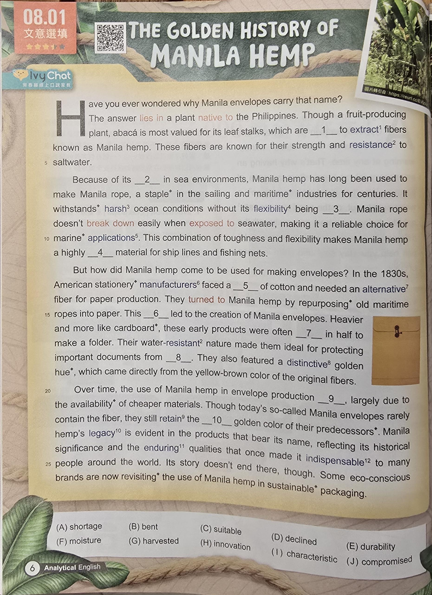

    
  
https://www.ivy.com.tw/newsLetter/analysis_cont/2025041410201719942/preview  
  
第二段單字  
  
environments  
[ɪnˈvaɪ.rən.mənts] en·vi·ron·ments 環境；周圍條件  
surrounding conditions affecting living things  
en 使進入 + viron 周圍 + ment 名詞語素 + s 複數  
en-是前綴，表示"使...進入某種狀態"  
viron來自法語virer，意為"轉動"或"圍繞"  
-ment是名詞語素  
-s是複數語素  
environments字面意思是"使被圍繞的狀態"，指影響生物或事物的周圍條件和因素。  
  
rope  
[roʊp] rope 繩子；繩索  
twisted fibers forming strong cord  
  
staple  
[ˈsteɪ.pəl] sta·ple 主要的；訂書釘；主食  
main or essential item  
  
sailing  
[ˈseɪ.lɪŋ] sail·ing 航行；帆船運動  
traveling by wind-powered boat  
sail 帆 + ing 動名詞語素  
sailing指使用風力推動船隻在水上航行的活動。  
  
maritime  
[ˈmær.ɪ.taɪm] mar·i·time 海事的；海上的  
relating to sea or ocean activities  
mari 海 + time 形容詞語素  
mari來自拉丁語mare，意為"海"  
-time是形容詞語素，相當於-timus，表示"與...相關的"  
maritime字面意思是"與海相關的"，指涉及海洋、航海或海上貿易的事物。  
  
industries  
[ˈɪn.də.striz] in·dus·tries 工業；產業  
organized commercial activities  
in 在內 + dustr 建造 + ies 複數名詞語素  
in-是前綴，表示"在...之內"  
dustr來自拉丁語struere，意為"建造"或"構建"  
-ies是複數名詞語素  
industries字面意思是"內部建造的活動"，指有組織的商業生產活動。  
  
centuries  
[ˈsɛn.tʃə.riz] cen·tu·ries 世紀；百年  
periods of one hundred years  
cent 百 + ur 連接語素 + ies 複數語素  
cent來自拉丁語centum，意為"一百"  
-ur是連接語素  
-ies是複數語素  
centuries字面意思是"一百年的時期"，指以百年為單位的時間段。  
  
withstands  
[wɪðˈstændz] with·stands 承受；抵抗  
resists or endures successfully  
with 對抗 + stand 站立 + s 第三人稱單數  
with在此作為前綴，表示"對抗"或"反對"  
stand來自古英語standan，意為"站立"  
-s是第三人稱單數語素  
withstands字面意思是"對抗性地站立"，指成功抵抗或承受壓力、攻擊等。  
  
harsh  
[hɑrʃ] harsh 嚴酷的；粗糙的  
rough or severe in character  
  
flexibility  
[ˌflɛk.səˈbɪl.ə.ti] flex·i·bil·i·ty 靈活性；彈性  
ability to bend without breaking  
flex 彎曲 + ibil 能夠 + ity 名詞語素  
flex來自拉丁語flectere，意為"彎曲"  
-ibil表示"能夠...的"  
-ity是抽象名詞語素  
flexibility字面意思是"能夠彎曲的性質"，指物體或概念具有適應變化的能力。  
  
exposed  
[ɪkˈspoʊzd] ex·posed 暴露的；無保護的  
left without cover or protection  
ex 向外 + pos 放置 + ed 過去分詞語素  
ex-是前綴，表示"向外"  
pos來自拉丁語ponere，意為"放置"  
-ed是過去分詞語素  
exposed字面意思是"向外放置的"，指沒有遮蔽或保護的狀態。  
  
reliable  
[rɪˈlaɪ.ə.bəl] re·li·a·ble 可靠的；值得信賴的  
consistently trustworthy  
re 再次 + li 綁定 + able 能夠的  
re-是前綴，表示"再次"或"回到"  
li來自拉丁語ligare，意為"綁定"或"連接"  
-able是形容詞語素，表示"能夠...的"  
reliable字面意思是"能夠再次綁定的"，指可以持續信任和依靠的。  
  
combination  
[ˌkɑm.bəˈneɪ.ʃən] com·bi·na·tion 結合；組合  
mixture of different elements together  
com 一起 + bin 二 + ation 名詞語素  
com-是前綴，表示"一起"或"共同"  
bin來自拉丁語bini，意為"成對的"或"兩個"  
-ation是名詞語素，表示動作或結果  
combination字面意思是"把兩個或更多事物放在一起"，指不同元素的混合或聯合。  
  
toughness  
[ˈtʌf.nəs] tough·ness 堅韌；強硬  
quality of being strong and durable  
tough 堅韌 + ness 抽象名詞語素  
toughness指具有堅韌、耐用和不易損壞的特質。  
  
material  
[məˈtɪr.i.əl] ma·te·ri·al 材料；物質的  
substance used to make things  
mater 母親，物質 + ial 形容詞語素  
mater來自拉丁語mater，原意為"母親"，引申為"物質"或"原料"  
-ial是形容詞語素，表示"與...相關的"  
material字面意思是"與物質相關的"，指用來製造或構成事物的基本物質。  
  
