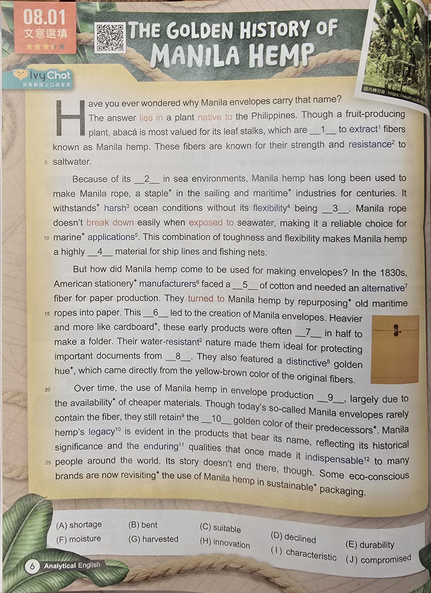

      
    
https://www.ivy.com.tw/newsLetter/analysis_cont/2025041410201719942/preview    
    
第四段單字    
  
due  
[du] due 到期的；應得的  
owed or expected at a certain time  
due 來自古法語deu(欠債的)  
  
availability  
[əˌveɪ.ləˈbɪl.ə.ti] a·vail·a·bil·i·ty 可獲得性；可用性  
the state of being accessible  
a 加強 + vail 價值 + able 能夠 + ity 名詞後綴  
這個單詞的構成：  
a- 前綴，加強語氣  
vail- 來自拉丁文valere(有力量，有價值)  
-able 形容詞後綴，表示"能夠的"  
-ity 名詞後綴，表示狀態或性質  
availability字面意思是"能夠發揮價值的狀態"，指某物可以被獲得或使用的狀態。  
  
rarely  
[ˈrɛr.li] rare·ly 很少；難得  
not very often or frequently  
rare 稀少 + ly 副詞後綴  
這個單詞的構成：  
rare 來自拉丁文rarus(稀少的，稀薄的)  
-ly 副詞後綴  
rarely意思是"以稀少的方式"，即不經常發生或很少出現。  
  
retain  
[rɪˈteɪn] re·tain 保持；保留  
to keep or continue to have  
re 回 + tain 持有  
這個單詞來自拉丁文：  
re- 前綴，表示"回"或"再次"  
tain- 來自tenere(持有，握住)  
retain字面意思是"重新持有"或"繼續持有"，指保持或保留某物不讓它失去。  
  
predecessors  
[ˈprɛd.əˌsɛs.ərz] pred·e·ces·sors 前任；前輩  
people who held a position before  
pre 前 + de 離開 + cess 走 + or 人 + s 複數  
這個單詞來自拉丁文：  
pre- 前綴，表示"在前面"  
de- 前綴，表示"離開"  
cess- 來自cedere(走，讓步)  
-or 名詞後綴，表示人  
-s 複數形式  
predecessors字面意思是"在前面走開的人"，指在某個職位或角色之前的人。  
  
legacy  
[ˈlɛg.ə.si] leg·a·cy 遺產；傳承  
something handed down from the past  
leg 法律 + acy 名詞後綴  
這個單詞來自拉丁文：  
leg- 來自lex, legis(法律)  
-acy 名詞後綴，表示狀態或性質  
legacy字面意思是"與法律相關的事物"，原指根據法律規定留給後人的遺產，後來引申為任何從過去傳承下來的事物，包括傳統、影響或成就。  
  
evident  
[ˈɛv.ɪ.dənt] ev·i·dent 明顯的；顯而易見的  
clearly seen or understood  
e 出 + vid 看見 + ent 形容詞後綴  
這個單詞來自拉丁文：  
e- 前綴，表示"出來"  
vid- 來自videre(看見)  
-ent 形容詞後綴  
evident字面意思是"能夠被看出來的"，指某事物清楚可見或容易理解。  
  
bear  
[bɛr] bear 承受、攜帶、生育；熊  
to carry or endure something  
bear 來自古英語beran(攜帶，生育)  
  
reflecting  
[rɪˈflɛk.tɪŋ] re·flect·ing 反映；反射  
showing or expressing something  
re 回 + flect 彎曲 + ing 現在分詞  
這個單詞來自拉丁文：  
re- 前綴，表示"回"或"向後"  
flect- 來自flectere(彎曲，轉向)  
-ing 現在分詞後綴  
reflecting字面意思是"向後彎曲"，指光線或思想的反射，引申為反映或表達某種狀況。  
  
significance  
[sɪgˈnɪf.ɪ.kəns] sig·nif·i·cance 重要性；意義  
the quality of being important  
sign 標記 + ific 製作 + ance 名詞後綴  
這個單詞來自拉丁文：  
sign- 來自signum(標記，符號)  
-ific- 來自facere(製作)，表示"製作"  
-ance 名詞後綴，表示狀態或性質  
significance字面意思是"製作標記的狀態"，指某事物具有重要含義或價值。  
  
enduring  
[ɪnˈdʊr.ɪŋ] en·dur·ing 持久的；忍耐的  
lasting for a long time  
en 使 + dur 硬 + ing 形容詞/現在分詞  
這個單詞來自拉丁文：  
en- 前綴，表示"使成為"  
dur- 來自durus(硬的，持久的)  
-ing 形容詞後綴或現在分詞  
enduring字面意思是"使成為堅硬的"，指能夠持續很長時間或具有持久性質。  
  
qualities  
[ˈkwɑl.ə.tiz] qual·i·ties 品質；特性  
distinctive attributes or characteristics  
qual 什麼樣 + ity 名詞後綴 + es 複數  
這個單詞來自拉丁文：  
qual- 來自qualis(什麼樣的，如何的)  
-ity 名詞後綴，表示狀態或性質  
-es 複數形式  
qualities字面意思是"什麼樣的狀態"，指事物的特徵、品質或屬性。  
  
indispensable  
[ˌɪn.dɪˈspɛn.sə.bəl] in·dis·pen·sa·ble 不可缺少的；必需的  
absolutely necessary or essential  
in 不 + dis 分離 + pens 懸掛 + able 能夠  
這個單詞來自拉丁文：  
in- 否定前綴，表示"不"  
dis- 前綴，表示"分離"  
pens- 來自pendere(懸掛，權衡)  
-able 形容詞後綴，表示"能夠的"  
indispensable字面意思是"不能被分離懸掛的"，指絕對必要、不可缺少的事物。  
  
conscious  
[ˈkɑn.ʃəs] con·scious 有意識的；清醒的  
aware and able to think clearly  
con 共同 + sci 知道 + ous 形容詞後綴  
這個單詞來自拉丁文：  
con- 前綴，表示"共同"或"一起"  
sci- 來自scire(知道，了解)  
-ous 形容詞後綴，表示"具有...性質的"  
conscious字面意思是"共同知道的"，指與自己內在的認知能力一起工作，即具有清醒的意識和自我覺察能力。  
  
eco-conscious  
[ˈi.koʊ ˈkɑn.ʃəs] e·co-con·scious 環保意識的；生態友好的  
aware of environmental impact  
eco 生態 + conscious 有意識的  
這是一個複合詞：  
eco- 來自希臘文oikos(家，環境)，表示"生態"  
conscious 來自拉丁文conscire(共同知道)  
eco-conscious意思是"對生態有意識的"，指關注環境保護和可持續發展的態度。  
  
brands  
[brændz] brands 品牌；商標  
company names or trademarks  
brand 烙印 + s 複數  
這個單詞來自：  
brand 來自古英語brand(燃燒的木頭，烙印)  
-s 複數形式  
brands原指用火燒的烙印來標記牲畜，後來引申為商業標識或品牌名稱。  
  
revisiting  
[riˈvɪz.ɪ.tɪŋ] re·vis·it·ing 重新審視；再次訪問  
examining or considering again  
re 再次 + vis 看見 + it 去 + ing 現在分詞  
這個單詞的構成：  
re- 前綴，表示"再次"  
vis- 來自拉丁文videre(看見)  
-it- 來自ire(去)  
-ing 現在分詞後綴  
revisiting字面意思是"再次去看見"，指重新檢視、考慮或訪問某事物。  
  
sustainable  
[səˈsteɪ.nə.bəl] sus·tain·a·ble 可持續的；可維持的  
able to continue without depletion  
sus 在下 + tain 持有 + able 能夠  
這個單詞來自拉丁文：  
sus- 是sub-的變體，表示"在下面"  
tain- 來自tenere(持有，支撐)  
-able 形容詞後綴，表示"能夠的"  
sustainable字面意思是"能夠在下面支撐的"，指能夠長期維持而不會耗盡資源的狀態。  
  
